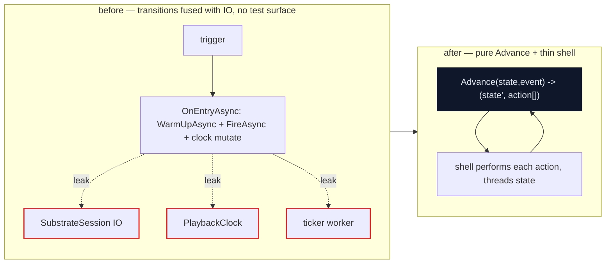
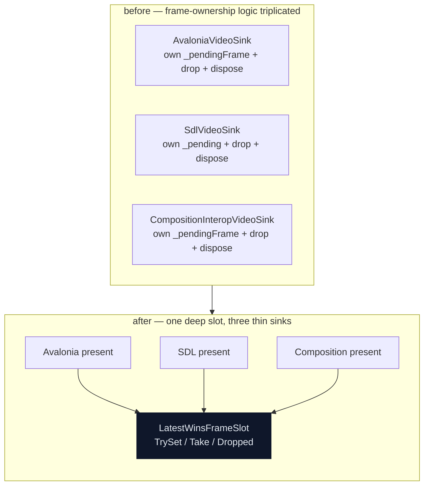

# FrameFlow architecture deepening review — exploration

> **Archived 2026-08-28.** This was a point-in-time survey, and all three of its
> top recommendations have since landed. It is kept for the reasoning behind
> them, which the resulting ADRs record only the conclusions of. **Do not treat
> it as live guidance** — it describes the tree as of 2026-06-20, ADR-0064, and
> the codebase has moved.
>
> Where each recommendation went:
>
> | Recommendation | Landed as |
> |---|---|
> | Finish the ADR-0055 pure-Mealy-core pattern across the remaining control planes (§1.1, §2.1, §5.1) | §1.1 demux pump → `src/FrameFlow.Decoding/Internal/DemuxPump.cs`; §2.1 playback state machine → `src/FrameFlow.Playback/PlaybackProtocol.cs`; §5.1 encode loop → `src/FrameFlow.Encoding/Internal/EncodeProtocol.cs`. `DecodeProtocol.cs` is the pre-existing exemplar these mirror, not one of the three. |
> | Slim the forked substrate to what has adapters (§3.1, §3.2, §3.4, §3.5) | Done — `StorageNode`, `FailureResponse.Retry` and `JoinFiringRule` no longer exist in `src/` |
> | Refresh the three stale top-level docs (§7.4, §7.5, §7.6) | Done — `README.md` and `ARCHITECTURE.md` no longer describe a "scaffolding stage", the dangling `MediaPlayerNext` xref is gone, and `SUBSTRATE_REFACTOR_AUDIT.md` is archived with its own banner |
>
> The companion HTML report this file used to reference has been removed: it was
> a rendering of this document that needed Tailwind and Mermaid from CDNs to
> display at all, and a stale visual copy of an archived survey is worth less
> than the diffable source it duplicated.

**Date:** 2026-06-20
**Status:** Exploratory. No decision committed; this is a point-in-time survey of
deepening opportunities and standards-conformance gaps, to be distilled into ADRs
/ deferred-work entries as candidates are chosen.
**Method:** Matt Pocock `improve-codebase-architecture` + `codebase-design` skills.
Whole-codebase sweep via **7 parallel reviewers** (one per cluster), each reporting
two axes — **architecture** (turn shallow modules into deep ones) and **standards**
(functional core / imperative shell, strongly-typed IDs, ADR conformance). The
design vocabulary (module / interface / depth / seam / adapter / leverage /
locality / the deletion test) is used deliberately.
**Scope:** the live tree — ~298 `src/` `.cs` across 20 non-empty projects, plus
~150 test and ~48 example `.cs` (478 total). Excludes `bin/`, `obj/`, `.git/`, and
the empty *untracked* `*.Next` directories (local cruft, not committed). The ADR
series runs through ADR-0064.

## How to read this

Each finding carries a **strength** — **Strong** (clear, high-leverage),
**Worth exploring** (real, needs a design pass), **Speculative** (latent / future
hardening) — an **axis** (architecture / standards), and a dependency-category tag.
"Before → After" sketches the shallow / fused shape and the deepened one. The skill's
next step is a *grilling* pass on whichever candidate is chosen; nothing here is decided.

---

## Cross-cutting patterns

Seven reviewers, independent lanes, converged on a small handful of shapes — and the
first one dominates the repo.

- **The pure-Mealy-core lens is proven, but the pattern stops at the decode loop.**
  ADR-0055 lifted the FFmpeg codec send/receive loop into a pure `DecodeProtocol.Advance`
  fold cranked by a thin `DecodeDriver` shell — 24 transcript tests, zero FFmpeg binaries.
  It is the repo's functional-core exemplar. Yet **four reviewers independently found the
  same control-plane shape still hand-inlined, fused with IO, and untested through its
  interface** elsewhere: the **demux read pump** (ADR-0055 *names* it as the sibling but
  only lifted `Classify`), the **playback state machine** (ADR-0055's own "sibling pattern
  one layer up" — a 522-LOC transition table with no isolated test surface), the **encode
  send/receive loop** (the literal mirror direction; the encoder's own doc calls itself
  "the encode mirror of `VideoDecoder`" yet doesn't reuse the core), plus the **SwScale
  reconfigure decision**, the **present-ring state machine**, and the **motion-clip gate**.
  The fix is uniform and already templated in-tree.
- **The verbatim fork's "defer slimming" is now actionable — and the answer is zero.**
  ADR-0049 took the Crossbar substrate into `FrameFlow.Graph` verbatim and explicitly
  deferred trimming "until consumer usage is observable." Usage is now observable:
  `StorageNode` has **zero** constructors repo-wide (and is structurally unusable on
  one-shot frames), `JoinNode` + its three firing rules have **zero** consumers, three of
  `EdgeOptions`' five axes are **read nowhere** by the runner, and `FailureResponse.Retry`
  is dead (annotated "Spike: not implemented"). Wide-and-shallow forked surface, pre-authorized
  for removal.
- **Duplicated shallow plumbing held in sync by hand.** Recurs in every lane: the
  seek-flush drain copied across both decoders (comments literally cite each other to
  stay aligned), the seven-step seek sequence duplicated across `SeekAsync` /
  `RewindToStartAsync`, three video sinks each re-implementing the latest-wins buffer,
  and ~190 lines of host-staging copy-pasted byte-identical across the two inference EP
  adapters. Each fails the deletion test.
- **Pure decisions trapped behind native IO — no test surface.** The same root as
  pattern 1, seen from the standards axis: the demux/playback/encode/present decisions,
  the SwScale "reconfigure?" predicate, the OpenAL master-clock math, the CUDA DLL-resolution
  verdict, the FFmpeg load verdict, and the YOLO preprocessor are all pure folds reachable
  only through real FFmpeg / OpenAL / D3D11 / CUDA, so the load-bearing branches have no
  isolated coverage. ADR-0055 is the template for each.
- **Stale committed docs misdirect every navigator.** `README.md` and
  `docs/ARCHITECTURE.md` still say the project is in the "planning and scaffolding stage"
  while the tree has a working substrate playback core, a zero-copy presenter, and 12
  runnable examples; a shipped `<see cref="MediaPlayerNext…"/>` xref (plus five example
  comments) names a type that no longer exists; `tests/SUBSTRATE_REFACTOR_AUDIT.md`
  describes a Crossbar-pipeline migration the ADR-0049 fork already superseded.

### Healthy grain to defend

FrameFlow's functional-core discipline is, where applied, textbook — and it is the
template the findings point back to. Defend the **ADR-0055 pure-core family**:
`DecodeProtocol` / `DecodeDriver`, `AudioPtsSynthesis.Advance`, `ISeekResettable`,
`LoopStallEvaluator`, `ClockSelectBuffer` / `ClockSelectVideoSink`, and
`PresenterStallEvaluator` — all immutable-value folds with the clock sampled as a
*parameter* and the shell owning IO. Defend the **real two-adapter seams**:
`IVideoSurface` (CPU + zero-copy), `IInferenceSession` (CUDA + DirectML),
`MultiOperatorNode` (three Whisper uses). And defend the **packaging discipline** —
the narrow `av*.dll;sw*.dll` dev-copy glob, `CopyToPublishDirectory="Never"`, and the
`FFNATIVE001` publish guard keep this repository's CUDA/cuDNN payload-bloat hazard closed.

### Three assumptions the review brief carried that didn't fully hold

- **Strongly-typed IDs are essentially N/A here.** FrameFlow is a media pipeline, not an
  entity-CRUD system — there are only ~3 raw `Guid` mentions in all of `src/`; stream
  indices are `int` and PTS/DTS are `long` by FFmpeg convention. No reviewer found a
  genuine transposable-identity gap. The standards axis here is **entirely** functional
  core / imperative shell; the typed-ID half of the repository spine simply has little to
  bite on. (This is a correction to carry forward, not a finding.)
- **The "delete the dead projects" cheap win that anchored the sibling reviews
  does not apply.** The `src/*.Next/` and two empty example directories are
  *empty and untracked* — local-only cruft, absent from git and the `.slnx`. The committed
  analogue is the stale `SUBSTRATE_REFACTOR_AUDIT.md` doc (§7.6), not a husk to delete.
- **The "route marshalling through one dispatcher seam" pattern does not apply.** UI-thread
  marshalling is already centralized behind `ObserveOnUIThread`; only **3** raw
  `Dispatcher.UIThread.Post` sites exist in all of `src/`, each a one-shot. Nothing to
  consolidate — this is healthy grain, not a finding.

---

## 1. Decode & demux core + media contracts

*The decode-loop exemplar (ADR-0055) is textbook and consistently applied inside the
decoder bodies; the deepenings cluster where its lens hasn't been carried through — the
demux pump, the seek-flush drain, and the frame ref-count contract.*

| # | Finding | Axis | Strength |
|---|---------|------|----------|
| 1.1 | Lift the demux read pump into a pure fold (ADR-0055's named-but-unlifted sibling) | standards | **Strong** |
| 1.2 | Collapse the seek-flush drain duplicated across both decoders | architecture | **Strong** |
| 1.3 | `IVideoFrame.AddRef` is in the interface but half the implementers throw | architecture | Worth exploring |
| 1.4 | Delete the `VideoFrameRef` / `PcmAudioBufferRef` pass-through wrappers | architecture | Worth exploring |
| 1.5 | Make the audio SWR re-arm a value, the last decode-side checklist | standards | Worth exploring |

#### 1.1 Lift the demux read pump into a pure fold
**Strong · standards · in-process**
**Files:** `src/FrameFlow.Decoding/DecodingPipeline.cs` (`RunDemuxPumpAsync`, `QueueClonedPacketAsync`, `SendPendingPacketAsync`), `src/FrameFlow.Decoding/Internal/DecodeProtocol.cs` (the exemplar to mirror)

**Problem.** The demux pump is a hand-inlined read→classify→route-by-stream-index→clone→retain-on-cancel
control plane fused with native `av_packet_ref`/`av_packet_free` and `await`, with no test
surface — the exact shape ADR-0055 retired for the decode half. ADR-0055 *names this as the
sibling* ("`Classify` mirrors `DecodingPipeline.ClassifyDemuxReadResult`"), yet only `Classify`
was lifted; the surrounding state machine (pending-packet retention, the seek-invalidates-pending
rule, stream routing) stays inlined and IO-fused — the class of bug ADR-0048/0056 already paid
for once.

**Solution.** Extract a pure `DemuxPump.Advance(PumpState, ReadOutcome) → PumpTransition` Mealy
core and let `RunDemuxPumpAsync` be the thin shell performing each action's native effect, exactly
as `DecodeDriver` does for the codec.

**Before → After.** One ~80-line `while` loop interleaving `av_read_frame`, classify, stream
branching, packet cloning, channel writes, and cancellation-retain bookkeeping → a 4-state pure
transition table (transcript-testable, no FFmpeg) + a shell that only clones/frees/writes; the
"retained pre-seek packet must be dropped" rule becomes a representable state, not a comment.

**Wins:** interface is the test surface · locality: the seek-invalidates-pending rule collapses to one state · deletion test passes · `await` / `av_packet_ref` stay in the shell
**ADR:** No conflict — this *fulfils* ADR-0055's own "Related control-plane purifications" lens, which scoped the demux half out only to stay focused.

#### 1.2 Collapse the seek-flush drain duplicated across both decoders
**Strong · architecture · in-process**
**Files:** `src/FrameFlow.Decoding/AudioDecoder.cs` (`Flush`), `src/FrameFlow.Decoding/VideoDecoder.cs` (`Flush`)

**Problem.** Both decoders carry a near-identical "flush codec buffers, then drain residual frames
in a `while` loop" block whose comments *cite each other* to stay aligned ("Mirrors the same
defence in AudioDecoder.Flush"). ADR-0055 §Context calls this exact smell out — "when two methods
reference each other to stay aligned by hand, they want to be one function" — but the decode-loop
refactor unified the send/receive path and left this drain-on-flush twin un-unified, untested in
isolation.

**Solution.** Lift the post-`avcodec_flush_buffers` residual-drain into one shared helper (on
`DecodeDriver` or the `IDecodeCodec` effect surface both already implement) and call it from both
`Flush()` bodies.

**Before → After.** Two `while(true){ receive; if(rc<0) break; unref; }` blocks kept identical by
paired comments → one drain function; each `Flush()` calls it after `avcodec_flush_buffers`.

**Wins:** locality: drain rule in one place · interface is the test surface (unit-coverable against the existing fake codec) · deletion test passes — the silent-desync is unrepresentable
**ADR:** No conflict — closes a residual item ADR-0055 named but scoped out.

#### 1.3 `IVideoFrame.AddRef` is in the interface but half the implementers throw
**Worth exploring · architecture · in-process**
**Files:** `src/FrameFlow.Media/IVideoFrame.cs`, `src/FrameFlow.Media/CpuVideoFrame.cs` (AddRef throws `NotSupported`), `src/FrameFlow.Media/PooledCpuVideoFrame.cs`, `src/FrameFlow.Decoding/GpuVideoFrame.cs`, `src/FrameFlow.Media/VideoFrameExtensions.cs` (the `CloneCpu` workaround)

**Problem.** `AddRef()` sits on `IVideoFrame`, but whether it works is a per-implementer *runtime*
fact — decoder `CpuVideoFrame` throws `NotSupportedException`; pooled/GPU frames succeed. The
interface promises a capability the type may not have, so callers either know the concrete type or
carry a `try`/`CloneCpu` fallback. That's a leaky, shallow seam: the contract a caller must learn
includes "and also, ask the concrete type whether this throws." (This same one-shot-frame property
is *why* the substrate's `StorageNode` is unusable here — see §3.1; the two findings share a root.)

**Solution.** Make shareability visible at the seam — a `TryAddRef(out IVideoFrame)` returning
`false`, or a narrower `IRefCountedFrame : IVideoFrame` only pooled/GPU frames implement — so
"one-shot" is a compile-time fact, not a runtime throw.

**Before → After.** `frame.AddRef()` compiles for every `IVideoFrame`, throws at runtime for a whole
category; fan-out guards with `CloneCpu` → one-shot vs shareable is a value/type the seam exposes;
callers and tests cross the same boundary.

**Wins:** interface is the test surface · leverage: the fan-out contract shrinks · locality: the one-shot/shareable split concentrates at the type boundary
**ADR:** ADR-0030 (unify frame contracts) — reopening justified: the unification put `AddRef` on the common contract, but three implementers disagree on honouring it, so the "unified" surface leaks the very distinction it meant to hide.

#### 1.4 Delete the `VideoFrameRef` / `PcmAudioBufferRef` pass-through wrappers
**Worth exploring · architecture · cleanup**
**Files:** `src/FrameFlow.Media/VideoFrameRef.cs`, `src/FrameFlow.Media/PcmAudioBufferRef.cs`, `src/FrameFlow.Media/IVideoFrame.cs`, `src/FrameFlow.Media/PcmAudioBuffer.cs`

**Problem.** Both `*Ref` wrappers exist solely to re-shape an already-refcounted type
(`IVideoFrame` / `PcmAudioBuffer`, which already expose `AddRef`+`Dispose`) into
`FrameFlow.Graph.IRefCounted`. `VideoFrameRef`'s own doc says the alternative is "make `IVideoFrame`
extend `IRefCounted`" and the wrapper was chosen for *migration safety* — a reason the repo's
"no consumers / no migration baggage" stance has voided. Apply the deletion test: removing the
wrappers removes only indirection (and a per-frame hot-path allocation). One adapter = a hypothetical
seam, not a real one.

**Solution.** Make `IVideoFrame : IRefCounted` and `PcmAudioBuffer : IRefCounted` directly; delete
both wrappers and their per-frame allocation.

**Before → After.** `new VideoFrameRef(frame)` / `new PcmAudioBufferRef(buf)` at every substrate
boundary → frames/buffers flow through the substrate unwrapped; `AddRef`/`Dispose` act on the frame
itself.

**Wins:** deletion test passes — the wrappers add no behaviour · leverage: one refcount surface, not two kept congruent · locality: per-frame allocation + ownership collapses to one object
**ADR:** No conflict — the migration-safety rationale is explicitly void under the no-consumers stance.

#### 1.5 Make the audio SWR re-arm a value, the last decode-side checklist
**Worth exploring · standards · in-process**
**Files:** `src/FrameFlow.Decoding/AudioDecoder.cs` (`Flush` re-arm, `BuildFrame` lazy-init gate, `InitializeSwrFromFrame`)

**Problem.** SWR (re)configuration is steered by two scattered mutable bools (`_swrInitialized` +
its blanket reset in `Flush()`), with the actual decision — "does this frame's format/rate/channels
differ from what SWR is armed for?" — left implicit. ADR-0055's follow-ups already turned PTS
synthesis (`AudioPtsSynthesis.Advance`) and seek invalidation (`ISeekResettable`) into values; the
SWR re-arm is the remaining hand-inlined checklist of the same family, so the adaptive-stream re-arm
branch has no isolated coverage.

**Solution.** Model the resampler arm-state as a pure `SwrArmPlan Decide(SwrConfig armedFor,
FrameFormat incoming) → {Reuse | Configure}` over immutable `(sampleFmt, sampleRate, channels)`;
keep `swr_alloc`/`swr_init`/`swr_convert` in the shell.

**Before → After.** `_swrInitialized` toggled in three methods, format-change handled by
blanket-resetting on every `Flush()` → a pure `Decide` returns Reuse/Configure; the shell acts on
it; re-arm fires exactly when the format changes and is unit-testable.

**Wins:** clock/IO out of core · interface is the test surface (matches `AudioPtsSynthesisTests`) · locality: the "when to re-arm" rule lives once
**ADR:** No conflict — extends the ADR-0055 follow-up lens to the one decode-side checklist it didn't reach.

---

## 2. Playback orchestration, state machine & clocks

*The clocks and the loop/stall evaluators are exemplary functional cores; the outlier is
the 522-LOC transition table at the centre of the repo's churn.*

| # | Finding | Axis | Strength |
|---|---------|------|----------|
| 2.1 | Extract the playback transition logic as a pure fold (the ADR-0055 sibling one layer up) | architecture | **Strong** |
| 2.2 | Collapse the seven-step seek sequence duplicated across seek + loop-rewind | architecture | **Strong** |
| 2.3 | Share the duplicated `Create` / `CreatePlaylist` wiring block | architecture | Worth exploring |

#### 2.1 Extract the playback transition logic as a pure fold
**Strong · architecture · in-process**
**Files:** `src/FrameFlow.Playback/PlaybackControllerCore.cs` (`ConfigurePlaybackMachine`), `tests/FrameFlow.Playback.Tests/PlaybackControllerIntegrationTests.cs`, `docs/adr/ADR-0055-decode-protocol-as-a-pure-mealy-core.md`

**Problem.** The event→next-state decisions live inside Stateless `OnEntry`/`OnExit`/`InternalTransition`
callbacks that directly create sessions, `await session.InitializeAsync`/`WarmUpAsync`/`PlayAsync`,
start/stop the ticker worker, mutate the clock, and fire sub-machines — state, IO, and timing are
fused, so the transition table has no isolated test surface. A repo-wide grep of `tests/` for
`InternalTransition|OnEntry|FireAsync|StateMachine<` returns **zero** files: every transition test
runs through `PlaybackController.Create` + real `LoadAsync`/`PlayAsync` under
`[RequiresFfmpegAndCorpusFact]`, so the load-bearing branches (stale-trigger drop, replay-from-Ended,
loop-vs-end, error routing) are exercised only end-to-end against FFmpeg corpus — the exact gap
ADR-0055 closed for the decoder one layer down, and ADR-0055 names this state machine as "the sibling
pattern one layer up."

**Solution.** Extract a pure `PlaybackProtocol.Advance(state, event) → (nextState, action[])` Mealy
core over the internal state/trigger enums, and let the dispatch loop be the thin shell that performs
each named action (create/dispose session, warm, play, ticker start/stop, clock ops).

**Before → After.**

**Wins:** interface is the test surface — the 522-LOC churn hotspot becomes transcript-testable like ADR-0055's 24 tests · locality: loop/end/error/replay routing concentrate one table cell each · deletion test: the protocol earns its keep · clock/IO out of core
**ADR:** No conflict — ADR-0023 keeps the channel-dispatch shell; this purifies *what* it dispatches, the explicit sibling ADR-0055 names.

#### 2.2 Collapse the seven-step seek sequence duplicated across seek + loop-rewind
**Strong · architecture · in-process**
**Files:** `src/FrameFlow.Playback/SubstrateSession.cs` (`SeekAsync`, `RewindToStartAsync`)

**Problem.** Both methods hand-walk the same ordered discontinuity recipe — close gates, pause
audio, settle/stop tasks, flush the pacer, deactivate audio, demux-reposition, `ResetForSeek` over
the participants, reseat both clocks, relaunch, reactivate+resume — differing only in cancel-vs-await
tasks and build-vs-reuse graph (~80 lines each). ADR-0056 already collapsed the *participant* axis
into `ISeekResettable`, but the *sequence* axis is still retyped twice, so a future seek-discipline
fix must land in two places to stay correct.

**Solution.** Express the discontinuity as one `RepositionAsync(target, graphPolicy, taskPolicy)`
shell (or a `SeekPlan` value) parameterized by the two knobs, so seek and loop-rewind run one sequence.

**Before → After.** Steps 1–7 written longhand in `SeekAsync`, then re-written in `RewindToStartAsync`
with two cells changed → `RepositionAsync(position, Rebuild, Cancel)` vs `RepositionAsync(Zero, Reuse,
AwaitClean)`.

**Wins:** locality: the four historical seek-state-leak bugs ADR-0048 catalogued get one home · deletion test: collapsing proves the sequence is load-bearing · leverage: cheap-rewind becomes a policy flag, not a parallel implementation
**ADR:** No conflict — extends ADR-0056's "one uniform pass" from participants to the sequence itself.

#### 2.3 Share the duplicated `Create` / `CreatePlaylist` wiring block
**Worth exploring · architecture · in-process**
**Files:** `src/FrameFlow.Playback/PlaybackController.cs` (`Create`, `CreatePlaylist`)

**Problem.** `Create` and `CreatePlaylist` are near-identical: same 10 ctor parameters, same
`Options.Create(...)`, same `new PlaybackControllerCore(...)` tail — they differ only in which
`IPlaybackSessionFactory` they construct. The duplicated parameter list and assembly tail are a
shallow pass-through edited in lockstep whenever the controller's construction shape changes.

**Solution.** Have both delegate to one private assembler and keep only the factory-construction
difference at each public entry.

**Before → After.** Two ~35-line methods identical except `SubstrateSessionFactory` vs
`PlaylistSessionFactory` → one shared assembler; each public method builds its factory and calls it.

**Wins:** locality: controller-construction changes land once · deletion test: the shared assembler earns its keep, the per-overload copy doesn't
**ADR:** No conflict.

### Healthy grain to defend
`LoopStallEvaluator` (pure `Observe` fold, `NowTicks` passed in), `ClockSelectBuffer.Select` +
`ClockSelectVideoSink` (pure value transform; shell owns the ring lock + Stopwatch, ADR-0057 Stage 2),
`PlaybackClock` + `ITimeSource` (every Stopwatch/`UtcNow` confined to the clock sources — **none**
buried in transition/sync core), `PlaylistCoordinator.DecideNext` (value-returning advance/replay/wrap
decision, tested FFmpeg-free), and `WorkerBinding<T>` (a 3-state Interlocked CAS lifecycle behind
`StartAsync`/`StopAsync`, ADR-0026) are all the pattern done right. §2.1 is about bringing the
transition table up to their bar.

---

## 3. Graph substrate & video operators

*`FrameFlow.Graph` is a verbatim fork (ADR-0049); the deepenings are the fork's own
pre-authorized slimming, now that consumer usage is observable and several primitives have zero adapters.*

| # | Finding | Axis | Strength |
|---|---------|------|----------|
| 3.1 | Delete `StorageNode` — dead forked surface, zero consumers, structurally unusable | architecture | **Strong** |
| 3.2 | Reduce `EdgeOptions` to the two axes the runner actually reads | architecture | **Strong** |
| 3.3 | Split the SwScale "reconfigure?" predicate out of the native call | standards | **Strong** |
| 3.4 | `JoinNode` + three firing rules: kept-for-V1 with zero consumers and zero tests | architecture | Worth exploring |
| 3.5 | `FailureResponse.Retry` is dead and the enum has drifted from its own ADR | architecture | Worth exploring |

#### 3.1 Delete `StorageNode` — dead forked surface
**Strong · architecture · cleanup**
**Files:** `src/FrameFlow.Graph/Nodes.cs` (`StorageNode<T>`), `src/FrameFlow.Graph/NodePumps.cs` (`PumpStorageAsync`), `src/FrameFlow.Graph/GraphChain.cs` (the `Then(StorageNode<T>)` overload)

**Problem.** `new StorageNode` appears **zero** times across src + examples + tests; the only
references are the substrate's own definition/pump/chain-overload plus example *comments* stating
the media consumer **cannot** use it ("Decoder + converter outputs are one-shot frames so we can't
use the substrate's StorageNode (which AddRefs)"). It is a vestigial identity pump that fails the
deletion test — fan-out is already served by multi-`Connect` on `OutputPort` + `EdgeConfig.WithCloner`
(ADR-0054), the path every example actually uses.

**Solution.** Delete `StorageNode<T>`, `PumpStorageAsync`, and the `GraphChain.Then(StorageNode<T>)`
overload; fan-out stays on `Graph.Connect` + cloner.

**Before → After.** A 1→N node type, its pump, and a chain overload — none ever constructed, blocked
by one-shot-frame semantics → fan-out is exactly one path (multi-`Connect` + cloner).

**Wins:** removes wide-and-shallow forked surface (the ADR-0049 §2 "defer slimming" is now actionable — usage is zero) · one fan-out seam, not two (the cloner is the real adapter; `StorageNode` is the hypothetical seam with no adapter) · shrinks the substrate's test obligation
**ADR:** ADR-0049 — §2 *pre-authorized* this removal ("vestigial identity pump… probably removable later"); reopening is justified because V1 usage is now observable and confirms zero use + a structural reason it never will.

#### 3.2 Reduce `EdgeOptions` to the two axes the runner reads
**Strong · architecture · cleanup**
**Files:** `src/FrameFlow.Graph/EdgeAxes.cs`, `src/FrameFlow.Graph/Graph.cs` (`CreateChannel`)

**Problem.** `EdgeOptions`' own docstring claims "the four axes together specify the edge's runtime
behaviour fully," but `CreateChannel` consumes only `Capacity` and `Overflow`; `EdgeShape` (Push/Pull),
`Cadence` (Producer/Consumer-Paced), `Underflow` (Block/Fail), and the derived `HasBackpressure` are
read nowhere at runtime (verified: zero readers). Interface ≈ implementation shallowness — a five-field
knob where three fields and one derived property are decorative, so the interface mis-describes the
behaviour behind it, and a caller setting `Cadence.ConsumerPaced` expects backpressure the channel
never provides.

**Solution.** Reduce `EdgeOptions` to the two fields the substrate honours (`Capacity`, `Overflow`)
until a pump genuinely dispatches on the others.

**Before → After.** A 5-axis edge contract claiming to fully specify runtime behaviour, 3 axes never
consulted → an edge contract carrying only what `CreateChannel` switches on; the docstring becomes
true.

**Wins:** kills wide-and-shallow surface the media consumer never exercises (each deleted axis has zero adapters) · removes a leaky seam that silently lies about backpressure · interface becomes the honest test surface
**ADR:** ADR-0049 — §2 keeps these "for V1" on speculative second-order patterns; reopening justified because the friction is concrete (an inert knob that lies), not cosmetic, and no consumer reads them.

#### 3.3 Split the SwScale "reconfigure?" predicate out of the native call
**Strong · standards · in-process**
**Files:** `src/FrameFlow.Video/SwScaleVideoConverter.cs` (`EnsureSwsContext`), `tests/FrameFlow.Video.Tests/VideoConverterTests.cs`

**Problem.** The reconfigure decision — a pure predicate over (srcW, srcH, srcFmt, dstW, dstH, dstFmt)
vs the cached tuple — is welded inside `EnsureSwsContext` to `sws_getContext` and six mutable
`_cachedXxx` field writes, the functional-core/imperative-shell fusion ADR-0055 warns against. The
only test touching it is `[RequiresFfmpegFact]`, needs real FFmpeg, and asserts only output width —
it cannot observe whether an *unchanged* shape correctly reuses the context or that the rebuild fired
exactly once. The decision is untested through any interface because there is no interface over it.
(Repowise flags `EnsureSwsContext` as a complex-conditional biomarker by name.)

**Solution.** Extract a pure `SwsPlan.Decide(currentKey, requestedKey) → (reuse | rebuild)` over an
immutable `SwsConfigKey`, leaving `EnsureSwsContext` as the thin shell that owns the `SwsContextHandle`.

**Before → After.** A 6-field equality check fused with `sws_getContext` + 6 mutable cache assignments
→ `SwsPlan.Decide` is a pure predicate unit-tested with no FFmpeg (mirrors `DecodeProtocol.Advance`);
the shell just executes reuse-vs-rebuild.

**Wins:** the plan value becomes the test surface — reconfigure logic testable without native libs · core/shell split: the predicate is a value, `sws_scale` is the shell · kills the named biomarker
**ADR:** No conflict — ADR-0037 names the converter as a stateful primitive wrapped by stateless operators; this sharpens that split.

#### 3.4 `JoinNode` + three firing rules: kept-for-V1 with zero consumers
**Worth exploring · architecture · cleanup**
**Files:** `src/FrameFlow.Graph/Nodes.cs` (`JoinNode`), `src/FrameFlow.Graph/Operator.cs` (`JoinFiringRule`), `src/FrameFlow.Graph/NodePumps.cs` (three `PumpJoin*Async`)

**Problem.** `new JoinNode` / `ToJoinA` / `ToJoinB` appear **zero** times in src + examples, and no
test constructs a join — yet the substrate carries ~225 LOC implementing three firing-rule pumps
(`WhenBoth`, `LatestWins`, `PrimaryDriven`). ADR-0049 §2 justifies keeping all three on A/V-sync +
caption-overlay use cases, but those consumers don't exist yet, so the two non-default variants are a
hypothetical seam (zero adapters) and the whole node is untested through the interface. (Contrast its
1→N sibling `MultiOperatorNode`, which **is** exercised end-to-end by `FrameFlow.Whisper.Tests` — that
earns its keep; the join's emptiness is what makes it notable.)

**Solution.** Either add one end-to-end test per firing rule the project commits to (turning the
hypothetical seam into a tested one), or slim to the single `WhenBoth` variant until an A/V-sync
consumer materializes.

**Before → After.** Three firing-rule pumps, no constructor call site, no test → a join surface that
matches observed demand (tested-because-used, or trimmed to the one rule a consumer needs).

**Wins:** distinguishes earned-keep (`MultiOperatorNode`: 2 real adapters) from speculative-keep (`JoinNode`: 0) · removes untested forked behaviour from the correctness surface
**ADR:** ADR-0049 — §2 keeps all three for V1; reopening is soft (A/V-sync is genuinely on the roadmap), so the lighter action is to add tests rather than delete.

#### 3.5 `FailureResponse.Retry` is dead and the enum has drifted from its own ADR
**Worth exploring · architecture · cleanup**
**Files:** `src/FrameFlow.Graph/NodeAxes.cs`, `src/FrameFlow.Graph/NodePumps.cs` (every site branches only on `Propagate`)

**Problem.** The pumps branch solely on `OnError == Propagate` vs everything-else; `Retry` is
referenced nowhere in pump logic (`Operator.cs` annotates it "Spike: not implemented"), a dead variant
callers can set with no effect — a shallow knob. `Discard` is implemented but untested. Separately,
ADR-0049 §2 documents the variants as `Propagate`/`Continue`/`Retry` while the code ships
`Propagate`/`Discard`/`Retry` — the verbatim fork's documentation already disagrees with its source.

**Solution.** Delete the unimplemented `Retry` member, add one `Discard`-path substrate test
(operator throws → input disposed, node continues), and fix the ADR §2 variant list.

**Before → After.** A 3-variant error policy where one variant is inert and one untested, ADR listing
a fourth name that doesn't exist → exactly the two behaviours the pumps implement, both covered; ADR
matches reality.

**Wins:** removes a set-but-ignored variant (interface lying about behaviour) · the surviving `Discard` becomes tested through the interface · closes ADR-vs-code drift
**ADR:** ADR-0049 — §2's keep-list is both stale (wrong member names) and speculative for `Retry`; minor reopening to align doc with the forked code.

### Healthy grain to defend
`Graph.RunAsync` re-runnability (small interface over per-edge reset actions enabling cheap
`RepeatMode.One` rewind, tested through the interface by `GraphRerunTests`), `EdgeConfig.WithCloner`
(ADR-0054 fan-out policy as a *value* with real adapters — the correct counter-model to the dead
`StorageNode`), the `VideoOperators` thin stateless wrappers over the stateful converter primitive,
and `MultiOperatorNode` (two real Whisper adapters — defend it against any "slim the fork" pass that
lumps it with its dead siblings).

---

## 4. Presentation & video sinks

*`PresenterStallEvaluator` and `IVideoSurface` are exemplary; the friction is the
freshly-churned present-ring state machine and the latest-wins buffer triplicated across three sinks.*

| # | Finding | Axis | Strength |
|---|---------|------|----------|
| 4.1 | Lift the present-ring state machine into a pure plan | architecture | **Strong** |
| 4.2 | Collapse the latest-wins buffer reimplemented in three sinks | architecture | **Strong** |
| 4.3 | Give the zero-copy converter its own device (execute ADR-0064 Decision 2) | standards | Worth exploring |
| 4.4 | Thin `CompositionInteropVideoView` — the 946-LOC god-control | standards | Worth exploring |
| 4.5 | Make SDL a third adapter to the presenter seam, not a parallel stack | architecture | Worth exploring |

#### 4.1 Lift the present-ring state machine into a pure plan
**Strong · architecture · in-process**
**Files:** `src/FrameFlow.Avalonia.Windows/CompositionInteropVideoView.cs` (`PresentRing` + scattered `_nextBuffer`/`_activeIsGpu`/`_videoWidth` fields), `tests/FrameFlow.Avalonia.Windows.Tests/ConverterRebuildTests.cs`

**Problem.** This repository already proves the pattern — `EvaluateConverterRebuild` is a pure static
predicate over a value, unit-tested six ways without a GPU. But the *rest* of the per-frame decision
(which ring slot is free, did the GPU↔CPU source flip, did the video size change, increment-or-drop)
lives as imperative reads/writes of scattered mutable fields inside `PresentRing` on the UI thread,
with **zero** test coverage. The interface is not the test surface for the loop that drives every frame.

**Solution.** Lift the per-frame present decision into a pure `PresentPlan Advance(PresentState,
FrameDescriptor)` fold (free-slot pick, source-flip detect, size-change detect, drop verdict) that the
view's shell executes — mirroring `EvaluateConverterRebuild` / `PresenterStallEvaluator`.

**Before → After.** `PresentRing` mutates `_nextBuffer`/`_activeIsGpu`/`_presentTasks` inline, correctness
only observable by running a compositor → a pure `PresentPlanner.Advance` returns
`{slotIndex | Drop, reimportRing?, updateLayout?}`; the shell does the import + keyed-mutex hand-off;
the planner is transcript-tested.

**Wins:** interface is the test surface (ring-rotation + source-flip become unit tests, not on-hardware checks) · locality: the per-frame decision concentrates in one pure function · clock out of core (the `Stopwatch.GetTimestamp()` stamp moves to the shell) · matches the in-tree exemplar
**ADR:** No conflict.

#### 4.2 Collapse the latest-wins buffer reimplemented in three sinks
**Strong · architecture · in-process**
**Files:** `src/FrameFlow.Avalonia/AvaloniaVideoSink.cs`, `src/FrameFlow.Sdl/SdlVideoSink.cs`, `src/FrameFlow.Avalonia.Windows/CompositionInteropVideoSink.cs`

**Problem.** All three `IVideoSink`s independently implement the same "latest-wins single-slot buffer
+ dispose-the-superseded + drop-counter + take-on-render-tick + PTS/wallclock diagnostics stamp" logic
(two via `Interlocked.Exchange`, one via a `lock`). This is duplicated inline marshalling of frame
ownership across the sink seam — delete any one and the buffer logic still exists twice more.

**Solution.** Extract a deep `LatestWinsFrameSlot` value (thread-safe set/take + superseded-dispose +
drop count) that all three sinks compose, leaving each sink owning only its platform present.

**Before → After.**

**Wins:** deletion test passes (the slot earns its keep across 3 callers) · locality: one place owns "newest wins, old one disposed" — the frame-leak-prone seam · leverage: drop-accounting + diagnostics learned once, reused 3× · interface is the test surface (dispose-on-supersede tested once)
**ADR:** No conflict.

#### 4.3 Give the zero-copy converter its own device (execute ADR-0064 Decision 2)
**Worth exploring · standards · ports & adapters**
**Files:** `src/FrameFlow.Avalonia.Windows/D3D11Nv12SharedConverter.cs`, `src/FrameFlow.Avalonia.Windows/D3D11BgraUploader.cs`, `docs/adr/ADR-0064-zero-copy-converter-device-ownership.md`

**Problem.** `D3D11Nv12SharedConverter` is a load-bearing object patched three times in the last three
commits (rebuild-on-swap, reactive device-loss flag, real diagnostics). The root awkwardness — named
in ADR-0064 Decision 2 — is that it *borrows* FFmpeg's decode device, fusing decode-device lifetime +
the keyed-mutex ring + per-frame timing + the sticky `_deviceLost` flag into one class. The sibling
`D3D11BgraUploader` already owns its own device and needs **none** of the warm-swap rebuild machinery
— direct evidence the borrow is the defect.

**Solution.** Execute ADR-0064 Decision 2 — give the converter its own device and open the decode NV12
by shared handle, so the converter outlives any player and the device-change rebuild path (and its
mutable identity comparison) deletes entirely.

**Before → After.** Converter borrows the decode device; `SourceDevicePointer` + `EvaluateConverterRebuild`
+ `DropGpuConverter(deviceChange:true)` exist to detect a swap → converter owns its device like the
uploader; warm-sink swap needs no rebuild; the device-identity comparison is gone.

**Wins:** deletion test passes (the device-change rebuild apparatus vanishes) · locality: decode-device lifetime stops leaking into presenter lifetime · the converter becomes a clean second adapter alongside the uploader (symmetric device ownership)
**ADR:** ADR-0064 — Decision 2 is explicitly "proposed/deferred" with a real blocker (FFmpeg's `BIND_DECODER`-only pool isn't shareable); this is a **cross-lane follow-up** paired with a `FrameFlow.Decoding` hwframes-pool change, not an in-lane fix.

#### 4.4 Thin `CompositionInteropVideoView` — the 946-LOC god-control
**Worth exploring · standards · in-process**
**Files:** `src/FrameFlow.Avalonia.Windows/CompositionInteropVideoView.cs`

**Problem.** One `Control` owns compositor/interop setup, the `DispatcherTimer` present cadence, the
per-frame present state machine, converter+uploader lifecycle, two-stage present accounting, the stall
watchdog wiring, and a 4-stage bounded-drain teardown. It is correctly the imperative shell, but it has
fused the *cadence* (a 16 ms timer) and the *present-plan logic* into the object that owns the D3D and
compositor handles, so none of the decision logic is reachable without a live compositor.

**Solution.** Keep the control as the thin shell (compositor handles, timer, teardown), but push the
present-plan (§4.1) and frame routing into pure helpers the timer tick drives — cadence stays
shell-owned, decisions become values.

**Before → After.** A 946-LOC control where cadence tick + free-slot logic + source routing + accounting
interleave on the UI thread → shell owns the timer + handles + teardown; a pure planner decides per
frame; the control drops well under half its size.

**Wins:** clock out of core (cadence remains a shell-owned timer advancing a pure state) · locality: teardown ordering stays in the shell, decisions leave it · interface is the test surface
**ADR:** No conflict.

#### 4.5 Make SDL a third adapter to the presenter seam
**Worth exploring · architecture · ports & adapters**
**Files:** `src/FrameFlow.Sdl/SdlVideoSink.cs`, `src/FrameFlow.Sdl/SdlEventLoop.cs`, `src/FrameFlow.Avalonia/IVideoSurface.cs`

**Problem.** `IVideoSurface` is a genuine two-adapter seam — `FrameFlowVideoView` (CPU) and
`CompositionInteropVideoView` (zero-copy) both satisfy it, and the player swaps between them with shared
chrome ("two adapters = real seam" — this passes). SDL does **not** plug into it: `SdlVideoSink` fuses
window + renderer + texture + the latest-wins buffer + thread-affinity assertion, and `SdlEventLoop` is
a separate static pump with its own `Thread.Sleep` pacing. SDL is a third presenter built as a parallel
stack rather than a third satisfier of the proven seam, so the seam's leverage stops at the Avalonia
family.

**Solution.** Factor SDL's frame intake onto the shared `LatestWinsFrameSlot` (§4.2) and express its
render as an `IVideoSink` peer, or explicitly document SDL as a standalone host outside `IVideoSurface`
— but don't leave the buffer logic triplicated by accident.

**Before → After.** SDL owns a bespoke sink + event loop; none of the Avalonia presenter seam is reused
→ SDL shares the frame-slot module and sink-shape; only the truly SDL-specific window/renderer/event-pump
stays bespoke.

**Wins:** leverage: the presenter seam extends to the third backend instead of stopping at two · deletion test: SDL's copy of the latest-wins buffer goes away · locality: frame-ownership rules concentrate
**ADR:** No conflict — ADR-0018/0019 keep the SDL *bootstrap* seam (`ISdlBootstrapper`) clean; this is about the sink/buffer layer.

### Healthy grain to defend
`PresenterStallEvaluator` (the lane's exemplar — pure Mealy fold, clock injected as a sample field,
zero D3D; `PresenterStallWatchdog` the matching thin shell), `EvaluateConverterRebuild` (pure, GPU-free,
6-way unit-tested — the model for §4.1), `IVideoSurface` (a real two-adapter seam), the **centralized**
`ObserveOnUIThread` marshalling (only 3 raw `Dispatcher.UIThread.Post` sites in all of `src/` — the
the sibling "one dispatcher seam" finding does *not* apply here), and the `CpuFramePool` owned-vs-caller
sink lifecycle.

---

## 5. Audio, encoding & motion-clip terminals

*The terminal sinks and the muxer are deep; the friction is the encode loop (a second
hand-inlined copy of the decode protocol), the OpenAL god class, and the motion gate's buried clock.*

| # | Finding | Axis | Strength |
|---|---------|------|----------|
| 5.1 | Route the encode send/receive loop through the ADR-0055 pure core | standards | **Strong** |
| 5.2 | Lift `OpenAlAudioSink`'s clock + buffer-queue out of the god class | architecture | **Strong** |
| 5.3 | Make the motion-clip `RecordingGate` a pure fold over a shell clock | standards | **Strong** |
| 5.4 | Give the audio resampler operator a real lifetime seam (stop suppressing CA2000) | architecture | Worth exploring |
| 5.5 | Extract `EncodedPacket` PTS synthesis + time-base rescale as pure arithmetic | architecture | Worth exploring |

#### 5.1 Route the encode send/receive loop through the ADR-0055 pure core
**Strong · standards · in-process**
**Files:** `src/FrameFlow.Encoding/Internal/H264VideoEncoder.cs` (`SendFrameAndDrain`, `DrainPackets`, `Flush`), `src/FrameFlow.Decoding/Internal/DecodeProtocol.cs`, `src/FrameFlow.Decoding/Internal/DecodeDriver.cs`

**Problem.** The encode direction (`avcodec_send_frame` on `EAGAIN`→drain→re-send, drain to `EOF` on
null-frame flush) is the exact mirror Mealy protocol ADR-0055 lifted to a pure core with a `Classify`
seam and 24 transcript tests — but here it is written longhand, fused with the native calls, with zero
isolated coverage. The encoder's own XML doc calls it "the encode mirror of `VideoDecoder`," yet it does
not reuse the mirror's tested core. This is precisely the "retyping the same protocol produces
divergence" failure ADR-0055 §Context names.

**Solution.** Generalize the ADR-0055 core to both directions (an `EncodeProtocol` sibling, or a
`CodecDirection`-parameterized `DecodeProtocol`) and drive `H264VideoEncoder` through the shared shell so
send/receive sequencing lives in one tested transition table.

**Before → After.** Encoder hand-inlines `while (sendRc == EAGAIN) { DrainPackets; re-send; }` + a
separate flush drain, classifying `Ok/Again/EOF/Fault` inline → encoder implements a narrow effect
surface (`SendFrame`/`ReceivePacket`/`BuildPacket`); all sequencing comes from the shared pure protocol,
transcript-tested with no FFmpeg.

**Wins:** one tested transition table replaces a second hand-inlined copy of the codec protocol · the encode/decode send-loop asymmetry becomes unrepresentable (as ADR-0055 made the audio/video one) · the codec ABI shrinks to one `Classify` seam on the encode side · interface becomes the test surface for the EAGAIN/flush/fault branches
**ADR:** No conflict — ADR-0055 explicitly scopes itself to the decode loop and lists the encode mirror as out-of-scope; this is the natural extension.

#### 5.2 Lift `OpenAlAudioSink`'s clock + buffer-queue out of the god class
**Strong · architecture · in-process**
**Files:** `src/FrameFlow.Audio.OpenAL/OpenAlAudioSink.cs`

**Problem.** This worst-health file in the repo (Repowise 1.0/10, "god class," 28 commits) fuses, behind
no internal seam: (1) OpenAL device/source/buffer IO; (2) the PCM coalesce + buffer-queue state machine
(`_stagingBuffer`/`_freeBuffers`/`FlushStep`); (3) the master-**clock** math
(`GetPlaybackTimeUnderLock`, `_processedSamplesPerChannel + sampleOffset`); (4) the seek-baseline origin
policy; (5) lifecycle/disposal (ADR-0044) + shared-device coordination (ADR-0058). The clock and the
queue state machine are pure functions of consumed sample counts and processed-buffer events, but they
are reachable only through the live OpenAL handle under `_stateLock`, so the master-clock decision is
**untested through any interface** — every clock-math test is `[RequiresAudioDeviceFact]` and "passes
trivially" with no device. The interface (`IClockSource`/`ISeekableClock`) is as wide as the implementation.

**Solution.** Lift the clock-position-from-samples and the buffer-queue/underrun bookkeeping into pure
values (`AudioClockState` / `BufferQueueState` advanced by `Recycle(processedBufferSizes) → state'` and
`Position(state) → TimeSpan`), leaving the sink a thin shell owning only the AL handle, the lock, and timing.

**Before → After.** Clock = `_baseSourceTime + (processed + sampleOffset)/rate` computed inside a method
that first calls `RecycleProcessedBuffers()` against live OpenAL — testable only with a device →
`AudioClockState.WithProcessed(samples).WithDeviceOffset(n).Position` is a total function unit-tested
with no hardware; the shell feeds it the two numbers it reads from OpenAL.

**Wins:** the master-clock decision becomes the test surface (the seek-rebaseline + counter-advance logic gets deterministic coverage) · deep module: a small `AudioClockState` value hides the cross-seek PTS-origin reasoning currently sprawled across three fields and three methods · races become unrepresentable for the clock half · matches `ClockSelectBuffer`'s already-blessed split (ADR-0057 Stage 2)
**ADR:** No conflict — ADR-0057 already endorses "clock value is a pure function of the time source, read on demand"; this completes that for the audio clock, which ADR-0057 left fused.

#### 5.3 Make the motion-clip `RecordingGate` a pure fold over a shell clock
**Strong · standards · in-process**
**Files:** `src/FrameFlow.MotionClip/RecordingGate.cs` (`ProcessAsync`, `StartBuilding`, `EmitSegment`)

**Problem.** The trigger/preroll/post-roll/max-frames decision is the classic pure-fold candidate
ADR-0052 §6 itself describes as a state machine, but it is implemented as imperative `switch`-over-mutable-fields
with the clock read inline (`_triggeredAt = DateTime.UtcNow`) and the clip carried as a mutable
`List<IVideoFrame>?` across calls — the opposite of the sibling `LoopStallEvaluator` (pure `Observe(sample)`
with `NowTicks` passed *in*) living in the same solution.

**Solution.** Extract a pure `GateCore.Advance(state, moved) → (phase', ClipDecision)` fold over an
immutable `GateState` (phase + post-roll-remaining + frame-count), with the shell owning the frame list,
the clone, and supplying `triggeredAt` from a shell-owned clock.

**Before → After.** `switch(_state){ case Building: _clip.Add(clone); if(moved) _postRollRemaining=… }`
with `DateTime.UtcNow` inside → `var (next, decision) = GateCore.Advance(_state, moved); if (decision is
Emit) shell.Finalize(now);` — the cadence is pure state advanced by the shell.

**Wins:** pure core exhaustively unit-testable with no camera/frames/clock (the post-roll-reset-on-motion and max-frames-cap branches get coverage) · follows the in-tree grain (`LoopStallEvaluator`, `DecodeProtocol`) · clock out of core logic · state/IO/timing un-fused
**ADR:** No conflict — ADR-0052 §6 calls the gate "intentionally minimal"; purifying it is consistent with that intent.

#### 5.4 Give the audio resampler operator a real lifetime seam
**Worth exploring · architecture · cleanup**
**Files:** `src/FrameFlow.Audio/AudioOperators.cs`

**Problem.** `Resample` is a shallow factory wrapping `IAudioResampler` in a closure, but it suppresses
a real CA2000 (`#pragma warning disable CA2000`) and documents that the `SwrContextHandle` is allocated
here yet "outlives the graph run until GC reclaims it" — an allocate-here/dispose-nowhere split leaning
on the finalizer. The EOS-flush caveat (trailing buffered samples silently dropped) is a leaky seam: the
interface hides that the operator is lossy at end-of-stream, and the caller cannot flush because the
operator owns the resampler privately.

**Solution.** Give the operator a real end-of-stream/disposal hook (deterministic `SwrContext` release +
tail flush), or keep resampling out of the graph and document it as explicitly real-time-lossy — but
don't suppress CA2000 to paper over a missing lifetime seam.

**Before → After.** `#pragma disable CA2000; var resampler = …` captured in a closure, finalizer-disposed,
tail dropped → operator owns the resampler with deterministic teardown; CA2000 satisfied by real ownership.

**Wins:** closes an allocate-here/dispose-there native-handle split (ADR-0044/0005) · removes a warning-suppression hiding the missing seam · makes lossy-at-EOS a named contract, not a buried caveat
**ADR:** No conflict.

#### 5.5 Extract `EncodedPacket` PTS synthesis + time-base rescale as pure arithmetic
**Worth exploring · architecture · in-process**
**Files:** `src/FrameFlow.Encoding/Internal/H264VideoEncoder.cs` (`BuildPacket`, the `_nextOutputPts` fallback), `src/FrameFlow.Encoding/Internal/Mp4Muxer.cs` (`Rescale`)

**Problem.** Two pieces of load-bearing pure integer arithmetic — the "codec left PTS unset, synthesize a
monotonic counter" fallback and the ABI-correct manual `ts·codecTb/streamTb` rescale that deliberately
avoids a broken `av_rescale_q` binding — live fused inside types exercisable only with real FFmpeg.
`Rescale` even carries a comment explaining a subtle x64 ABI bug it works around, yet nothing pins that
the arithmetic is correct (rounding, NOPTS passthrough, overflow bounds).

**Solution.** Lift `Rescale` and the PTS-synthesis step to small pure static helpers (or a
`PtsRescale.Advance` fold mirroring the already-done `AudioPtsSynthesis.Advance`) and unit-test the
arithmetic without FFmpeg.

**Before → After.** `long num = ts*codecTbNum*streamTbDen; return (num + den/2)/den;` reachable only
after `avformat_write_header` → `TimeBaseRescale.Convert(ts, codecTb, streamTb)` — pure, with table-driven
tests for rounding, NOPTS passthrough, and the degenerate-denominator guard.

**Wins:** the ABI-workaround arithmetic (a documented past bug) gets a regression test without native binaries · parallels the already-shipped `AudioPtsSynthesis.Advance`, encode side · interface becomes the test surface for the timestamp math the muxer depends on
**ADR:** No conflict.

### Healthy grain to defend
`Mp4VideoWriter` (a genuinely deep terminal — small surface over real flush-then-trailer EOS ordering;
clean native-ownership split, ADR-0005 honoured), `MotionClipRecorder` (exists specifically to kill a
documented two-places drift; composes by delegation, owns disposal ordering), `ClipEncoderSink`'s bounded
`Channel` + worker (the correct shell for the camera-reconnect/encode-latency timing edge), and — again —
`LoopStallEvaluator` / `DecodeProtocol` / `ClockSelectBuffer` as the shapes §5.1–5.3 should refactor toward.

---

## 6. Native bootstrap, inference & packaging

*`IInferenceSession` is a real two-adapter seam and the YOLO descriptor/postprocessor are
deep pure cores; the friction is host-staging copy-pasted across both EPs and the bootstrap verdicts
trapped behind native IO. **Payload-bloat watch: clean.***

| # | Finding | Axis | Strength |
|---|---------|------|----------|
| 6.1 | Hoist the host-staging duplicated byte-identical across both EP adapters | architecture | **Strong** |
| 6.2 | Make the EP sessions + CUDA DLL-resolution testable through their interfaces | architecture | **Strong** |
| 6.3 | Split the FFmpeg load *verdict* out of the bootstrap shell | standards | Worth exploring |
| 6.4 | Add the missing test surface for the pure `Yolov8Preprocessor` | standards | Worth exploring |

#### 6.1 Hoist the host-staging duplicated across both EP adapters
**Strong · architecture · in-process**
**Files:** `src/FrameFlow.Inference.Cuda/CudaInferenceSession.cs`, `src/FrameFlow.Inference.Dml/DmlInferenceSession.cs`, `src/FrameFlow.Inference.Abstractions/IInferenceSession.cs`

**Problem.** `IInferenceSession` is a real two-adapter seam, but the host→ORT staging that ADR-0049 §3
says is shared (`BindCpuTensor`, `ToLongShape`, `MapDType`, `ValidateNames`, `BuildShapes`, and the whole
dictionary-`Run` IoBinding loop) is copy-pasted **byte-identical** into both EPs (verified by diff); only
`BuildSessionOptions` legitimately differs. The seam leaks: the shared implementation lives in two places,
so the EP boundary is shallower than it looks and a staging bugfix must be made twice.

**Solution.** Hoist the identical staging into one `OrtInferenceSessionBase` (or a static `OrtHostBinding`
helper) in the abstractions package, leaving each EP to override only `BuildSessionOptions()`.

**Before → After.** Two ~270-line sessions, ~190 lines identical, the EP difference buried in one private
method each → one staging core + two ~40-line EP shells that supply session-options (+ the CUDA-only
`OrtValue` escape hatch).

**Wins:** deep seam — the per-EP difference shrinks to bootstrap/options, exactly as ADR-0049 §3 states · deletion test: the base earns its keep (staging vanishes from both callers) · one test surface stages host memory once, not per-EP · a third EP becomes options-only, not another 190-line copy
**ADR:** ADR-0049 — §3 *mandates* this shape; the code currently violates its own ADR.

#### 6.2 Make the EP sessions + CUDA DLL-resolution testable through their interfaces
**Strong · architecture · in-process**
**Files:** `src/FrameFlow.Inference.Cuda/CudaInferenceSession.cs`, `src/FrameFlow.Inference.Dml/DmlInferenceSession.cs`, `src/FrameFlow.Inference.Cuda/Bootstrap/CudaDllResolver.cs`, `tests/FrameFlow.Inference.Abstractions.Tests/`

**Problem.** The factory seam and `YoloModelDescriptor.FromSession` are tested through a
`FakeInferenceSession`, but the two **concrete** `IInferenceSession` implementations have zero tests, and
`CudaDllResolver`'s "which path / which RID / found-or-missing" decision is fused with live
`Directory.Exists`/`File.Exists`, so it is untestable without a real CUDA/cuDNN install. The interface
consumers actually run on a target is not the test surface.

**Solution.** Extract the resolver's path-decision into a pure function over `(rid, candidate roots,
isPresent predicate)` with a thin shell binding the real filesystem, and add a contract test the shared
staging base (§6.1) satisfies for both EPs.

**Before → After.** Decision = filesystem walk, verified only by running on a machine that already has
CUDA → a pure decision exhaustively unit-testable with a synthetic file table; the shell does only
`Directory.Exists`.

**Wins:** the interface becomes the test surface (both for the EP seam and the bootstrap fold) · functional core / imperative shell: the probe decision is a value transform, `NativeLibrary.Load`/PATH-mutation stays in the shell · first-run "CUDA found vs missing" diagnostics become reproducible in CI
**ADR:** No conflict.

#### 6.3 Split the FFmpeg load *verdict* out of the bootstrap shell
**Worth exploring · standards · in-process**
**Files:** `src/FrameFlow.Native/FfmpegNativeLibraryLoader.cs`, `src/FrameFlow.Native/FFmpegLibraryResolver.cs`, `src/FrameFlow.Native/FrameFlowBootstrapper.cs`

**Problem.** `FFmpegLibraryResolver.CandidatePaths` is a clean, tested pure value-producer, but the actual
"which candidate exists / does the version probe pass / found-or-missing" verdict is fused inside
`FfmpegNativeLibraryLoader.TryLoad` with `NativeLibrary.TryLoad`, static mutable handle state, and the
`avutil_version()` call — so the resolution verdict can't be exercised without real FFmpeg binaries. The
decision (a pure fold over RID + search paths + what-exists) and the IO (load + probe) are one object.

**Solution.** Keep `IFfmpegLibraryLoader` as the shell seam, but factor the per-library candidate-walk-and-pick
into a pure decision taking an injected `Func<string,bool> exists`, leaving `TryLoad` to perform only the
chosen load + probe.

**Before → After.** `TryLoad` decides AND loads AND probes AND caches in static fields → a pure "what would
we try, in what order, given this filesystem snapshot" core; the shell loads the winner.

**Wins:** functional core / imperative shell separation in the load-bearing bootstrap path · resolution-order regressions caught by value tests, not by a machine with FFmpeg installed · the existing stub seam stays — this deepens what is testable behind it
**ADR:** No conflict — ADR-0002/0014 unaffected; an internal split.

#### 6.4 Add the missing test surface for the pure `Yolov8Preprocessor`
**Worth exploring · standards · in-process**
**Files:** `src/FrameFlow.Yolo/Yolov8Preprocessor.cs`, `tests/FrameFlow.Yolo.Tests/` (no `Yolov8PreprocessorTests.cs`)

**Problem.** The preprocessor's `ResizeAndNormalize` (resize + BGRA/RGBA→RGB + HWC→CHW + /255, writing into
a caller span) is a textbook deterministic pure core — the exact functional-core candidate ADR-0055's grain
calls for — yet `Yolov8Postprocessor` (6 tests) and `FromSession` (10 tests) are covered while the
preprocessor has **none**. The scale-factor contract the postprocessor's coordinate-mapping depends on is
never asserted, so a "pure-functions-extracted-but-bugs-in-the-calls" gap sits between the two halves.

**Solution.** Add a `Yolov8PreprocessorTests` that feeds a hand-built `IVideoFrame` and asserts the CHW byte
layout, channel order for both BGRA/RGBA, and the returned `(ScaleX, ScaleY)` against the postprocessor's
expectation.

**Before → After.** The model-space↔source-space scale contract verified only end-to-end with a real ORT
session → preprocess/postprocess round-trip asserted as pure values, no GPU/model needed.

**Wins:** the pure core's interface becomes its test surface · locks the preprocess→postprocess coordinate contract split across two types · cheap deterministic coverage of a high-churn inference path
**ADR:** No conflict.

> **Payload-bloat watch — CLEAN.** No over-broad CUDA/cuDNN/onnxruntime native glob on the inference side.
> `FrameFlow.Inference.Cuda.csproj` ships **no** native copy rules (GPU natives flow only from the
> `Microsoft.ML.OnnxRuntime.Gpu` package's per-RID assets); `FrameFlow.Inference.Dml.csproj` copies exactly
> **one named file** (`DirectML.dll`), not a glob; `FrameFlow.Native.csproj` packs the **7 explicitly-named**
> `av*`/`sw*` DLLs with a comment deliberately excluding CUDA/cuDNN (~3 GB). The only broad native glob in
> the tree is the root `Directory.Build.targets` `av*.dll;sw*.dll` dev-copy, which is
> `CopyToPublishDirectory="Never"` and guarded by the `FFNATIVE001` publish check — so `scripts/fetch-cuda.cs`'s
> dev redists cannot leak into a self-contained publish.

### Healthy grain to defend
`YoloModelDescriptor.FromSession` (a pure decision fold over session input/output shapes, exhaustively
tested via `FakeInferenceSession`), `Yolov8Postprocessor` (pure NMS/box-decode value transform with an
isolated test surface), `InferenceSessionFactoryBuilder` / `LazyResolvingFactory` (a genuinely deep module:
preferred+fallback EP resolution + lazy caching + progress phases behind a small interface — delete it and
every model wrapper re-grows EP-selection), and `CameraFrameAdapter` (the reference *thin* adapter — wraps
`Periphery.Camera.ICameraFrame` as `FrameFlow.Graph.IFrame` without re-fusing ownership or leaking Periphery
types into the substrate, ADR-0049 §4 / ADR-0045).

---

## 7. Examples, harnesses & docs coherence

*The capture harness is a genuinely deep, single-seam pattern; the friction is the
documented-but-unexercised consumer surface, the three divergent example call sites, the audio-master
content gap, and three stale top-level docs.*

| # | Finding | Axis | Strength |
|---|---------|------|----------|
| 7.1 | Exercise (or retire) the documented DI builder surface no consumer calls | architecture | **Strong** |
| 7.2 | Converge the three divergent example construction shapes on one canonical surface | architecture | **Strong** |
| 7.3 | Close the audio-master clock content-coverage gap | architecture | **Strong** |
| 7.4 | Fix the phantom `MediaPlayerNext` xref shipped in a doc-comment | docs | **Strong** |
| 7.5 | Refresh `README.md` + `ARCHITECTURE.md` — they describe a not-yet-built project | docs | **Strong** |
| 7.6 | Archive the stale `SUBSTRATE_REFACTOR_AUDIT.md` | docs | Worth exploring |

#### 7.1 Exercise (or retire) the documented DI builder surface no consumer calls
**Strong · architecture · ports & adapters**
**Files:** `src/FrameFlow.Audio.OpenAL/FrameFlowOpenAlBuilderExtensions.cs`, `src/FrameFlow.Avalonia/FrameFlowAvaloniaServiceCollectionExtensions.cs`, `examples/FrameFlow.Examples.HostedServicePlayer/Program.cs`

**Problem.** The `IFrameFlowBuilder` DI seam (`AddFrameFlowOpenAlAudio()`, `AddFrameFlowAvaloniaVideoSink()`)
exists and is documented with `<example>` blocks matching the README's "DI, options, host-friendly" pitch,
yet **zero** of the 12 in-`.slnx` examples and **zero** integration tests call it — every consumer
constructs sinks by hand. The interface is the test surface, and this interface has none; its deletion
test arguably passes today.

**Solution.** Convert one example (HostedServicePlayer is the natural fit) to drive the DI builder
end-to-end so the seam is exercised, or delete the unused builder extensions until a consumer needs them.

**Before → After.** `new OpenAlAudioSink()` + manual `WithAudioSink(sink)` wiring in every host →
`services.AddFrameFlow().AddFrameFlowOpenAlAudio()` exercised by at least the hosted example.

**Wins:** interface is the test surface — the DI seam gets a real consumer, not just XML docs · deletion test forces the call: keep it (and prove it) or drop it · locality: the documented shape and the example shape stop contradicting each other
**ADR:** ADR-0001 — api-first sequencing assumes the DI surface is the consumer entry; reconcile by exercising or retiring it.

#### 7.2 Converge the three divergent example construction shapes
**Strong · architecture · in-process**
**Files:** `examples/FrameFlow.Examples.AudioOnlyPlayer/Program.cs` (`FrameFlowPlayer.Open(…).BuildAsync()`), `examples/FrameFlow.Examples.SdlPlayer/Program.cs` (`PlaybackController.Create(…)`), `examples/FrameFlow.Examples.AvaloniaPlayer/MainWindow.axaml.cs` (`MediaPlayer.CreateAsync(…)`), `examples/FrameFlow.Examples.HostedServicePlayer/Program.cs`

**Problem.** Three distinct consumer entry points coexist with no documented "use this one": the
`MediaPlayer.CreateAsync` façade (6 examples), the lower-level `PlaybackController.Create` (SdlPlayer), and
the `FrameFlowPlayer.Open(…).BuildAsync()` fluent builder (AudioOnlyPlayer, HostedServicePlayer). A
navigator must bounce across three examples to learn "how do I start playback," and the project's mandate to
propagate a better call site to *every* example is unmet.

**Solution.** Pick one canonical surface per scenario (façade for app hosts, controller only where the raw
state machine is the point), align the stragglers, and document the choice in the README.

**Before → After.** Three entry points, reader infers which is current from comments → one documented façade
per scenario; controller used only where intentional.

**Wins:** locality: one obvious starting call site · leverage: a future call-site improvement lands in one shape, not three · deletion test: clarifies whether `FrameFlowPlayer.Open` and `MediaPlayer.CreateAsync` are two seams or one redundant pair
**ADR:** ADR-0024 — playback controller as public API surface; clarify whether `MediaPlayer`/`FrameFlowPlayer` sit above it as the intended consumer entry.

#### 7.3 Close the audio-master clock content-coverage gap
**Strong · architecture · mock**
**Files:** `tests/FrameFlow.Integration.Tests/Harness/Capture/CapturingAudioSink.cs`, `tests/FrameFlow.Integration.Tests/Harness/ClockMasteringReseatAudioSink.cs`, `tests/FrameFlow.Integration.Tests/ContentCaptureTests.cs`, `src/FrameFlow.Playback/SubstrateSession.cs`

**Problem.** `SubstrateSession` selects the audio sink as master clock only when `_audioSink is IClockSource`;
`CapturingAudioSink` deliberately is **not** one, so the content-capture suite verifies decoded PCM/pixels
only on the **wallclock** master. The one `IClockSource` double (`ClockMasteringReseatAudioSink`) is used
only by seek/loop tests that assert origin reseating and capture **no content** — so the production
audio-master path (ADR-0003/0035/0057) is never checked for content correctness through the interface.
This is exactly the gap the audit's Action 4 deferred and the bug behind commit `1e19ca2`.

**Solution.** Add a content-capturing `IClockSource` audio sink (merge `CapturingAudioSink`'s sample
retention into the `ClockMasteringReseatAudioSink` clock model) and run the existing content invariants
against the audio-master master.

**Before → After.** Content invariants run wallclock-master only; audio-master content-untested → one
capturing-clock-master sink runs the same `PlaybackInvariants` on the production path.

**Wins:** interface is the test surface — the real master-clock path becomes assertable through the same harness · deletion test: closes a path no harness can exercise · locality: one capture seam covers both clock masters
**ADR:** ADR-0031 — content-comparing capture sinks were meant to cover the real path; this completes that intent.

#### 7.4 Fix the phantom `MediaPlayerNext` xref shipped in a doc-comment
**Strong · docs · docs**
**Files:** `src/FrameFlow.Playback/PlaybackController.cs` (`<see cref="MediaPlayerNext.CreateAsync"/>`), `examples/FrameFlow.Examples.Multicast/MainWindow.axaml.cs`, `examples/FrameFlow.Examples.Multicast.Dml/MainWindow.axaml.cs`, `examples/FrameFlow.Examples.AvaloniaPlayer/MainWindow.axaml.cs`

**Problem.** No type named `MediaPlayerNext` exists (the ".Next" rename folded back to `MediaPlayer`), but
a shipped `<see cref="MediaPlayerNext.CreateAsync"/>` in `PlaybackController.cs` dangles (an unresolvable
xref that breaks doc-comment resolution) and five example comments still narrate `MediaPlayerNext.CreateAsync`
while the code calls `MediaPlayer.CreateAsync`. A navigator reading the comment looks for a type that isn't there.

**Solution.** Rename the `<see cref>` and the five comments to `MediaPlayer`.

**Before → After.** Comments and one xref reference a non-existent `MediaPlayerNext` → all references name the
real `MediaPlayer`.

**Wins:** locality: comment matches the call it sits above · the doc xref resolves again
**ADR:** No conflict.

#### 7.5 Refresh `README.md` + `ARCHITECTURE.md` — they describe a not-yet-built project
**Strong · docs · docs**
**Files:** `README.md` ("currently in the planning and scaffolding stage… the real FFmpeg bootstrap, demuxing, decoding, playback, and presentation logic still need to be implemented"), `docs/ARCHITECTURE.md` ("sketches a fresh-start architecture for rebuilding this library from first principles")

**Problem.** Both top-level navigator docs frame the project as pre-implementation while the repo has ~298
src `.cs` files, the full ADR series through ADR-0064, a working substrate playback core, a zero-copy
presenter, and 12 runnable examples that play real media. Every new navigator is told the opposite of
reality at the first file they open, and the README documents no actual consumer construction surface at all.

**Solution.** Rewrite the README "Current status" and the ARCHITECTURE.md framing to describe the implemented
substrate/playback/presenter reality, and add one real construction snippet.

**Before → After.** "Planning and scaffolding stage"; greenfield rewrite framed as future → status reflects
the working core; ARCHITECTURE.md describes the landed design.

**Wins:** locality: the first doc a navigator reads is true · leverage: correct orientation compounds across every future session
**ADR:** No conflict.

#### 7.6 Archive the stale `SUBSTRATE_REFACTOR_AUDIT.md`
**Worth exploring · docs · docs**
**Files:** `tests/SUBSTRATE_REFACTOR_AUDIT.md`

**Problem.** The audit describes a Crossbar-pipeline-API migration (`FramePipeline`/`FramePacket`/`.AsPipeline`/`.ToSink`)
as in-flight and its Action 1 claims `PlaybackHarness` still inlines `.Observe().RunAsync()` pull-mode
capture — but the ADR-0049 fork pulled the substrate into `FrameFlow.Graph`, `using Crossbar` is gone, and
the current harness no longer inlines that pattern. By its own "Maintenance" clause the doc is a migration
artifact whose conditions have passed; the one surviving gap it names (the master-clock coverage of §7.3)
is the only live item.

**Solution.** Archive the audit to `docs/archive/` (preserving the §7.3 gap as a deferred-work entry),
since the migration it tracks has landed.

**Before → After.** A committed audit references a deleted API surface and a since-removed inline-capture
pattern as live → archived; the one surviving gap tracked in the backlog.

**Wins:** locality: a navigator isn't pointed at a deleted Crossbar API as current · deletion test: the doc's own maintenance clause says retire it now
**ADR:** ADR-0049 — the fork the doc predates; archiving aligns docs with the completed migration.

### Healthy grain to defend
`FramePacker.Pack` (one shared deep capture seam — both `CapturingVideoSink` and `ReferenceDecoder` pack
pixels through it, guaranteeing byte-identical `VideoCapture` records; the audit's Action 1 "duplicated
capture" concern is obsolete), `PlaybackHarness.PlayCorpusFileNextAsync` (the single gold-standard
"load → play to EOF → return captures + terminal state" seam, with `PlaybackCaptureResult` for fail-fast),
the deliberate two-axis sink split (`Harness*Sink` lifecycle-only vs `Capturing*Sink` +content, each
documented as differing in one axis), and the `ExampleLogPaths`-driven `--log-file` observability convention
(honoured by every one of the 12 in-`.slnx` examples).

---

## Top recommendations

- **Highest leverage — finish the ADR-0055 pure-Mealy-core pattern across the remaining control planes
  (§1.1 + §2.1 + §5.1).** The decode loop got the treatment; the demux pump, the 522-LOC playback state
  machine (the repo's biggest untested churn hotspot), and the encode loop are the *same shape* still
  hand-inlined, fused with IO, and exercised only end-to-end against FFmpeg corpus. The project already has
  the exemplar **and** the test pattern (24 transcript tests, no binaries) in-tree, plus the sibling folds
  (`LoopStallEvaluator`, `AudioPtsSynthesis`, `ClockSelectBuffer`, `PresenterStallEvaluator`) that prove it
  generalizes. This is unblocking proven intent, not new architecture — and the decode + encode halves can
  share one direction-parameterized protocol. Land §2.1 first; it carries the most untested risk.
- **Cheapest win — slim the forked substrate to what has adapters (§3.1 + §3.2 + §3.4 + §3.5).** ADR-0049
  took the Crossbar substrate verbatim and explicitly deferred trimming "until consumer usage is observable."
  Usage is now observable and it is **zero** for `StorageNode`, `JoinNode`'s non-`WhenBoth` rules, three of
  `EdgeOptions`' five axes, and `FailureResponse.Retry`. Pre-authorized, mechanical, removes wide-and-shallow
  surface that silently lies about backpressure, and closes the ADR-vs-code drift the verbatim fork introduced.
- **Near-free navigability — refresh the three stale top-level docs (§7.5 + §7.4 + §7.6).** `README.md` and
  `ARCHITECTURE.md` still tell every new navigator the project is in the "scaffolding stage"; a shipped
  `<see cref="MediaPlayerNext…"/>` dangles; the substrate audit describes a superseded migration. These are
  the first files anyone (human or agent) opens, and all three currently describe a repo that no longer exists.
  Low effort, compounding leverage on every future session.
