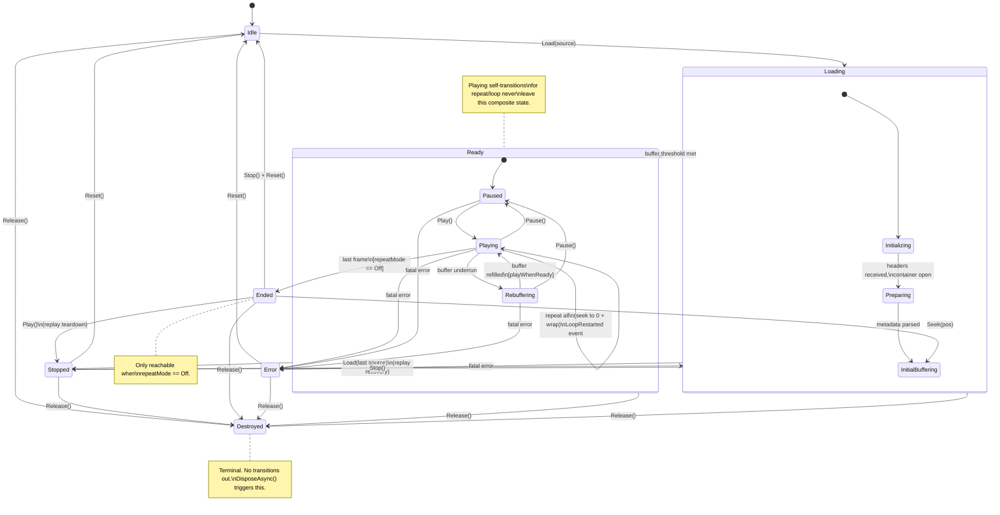
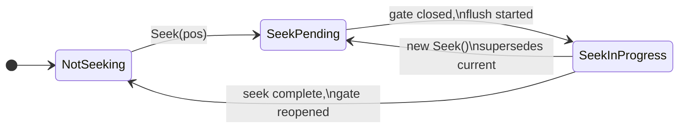
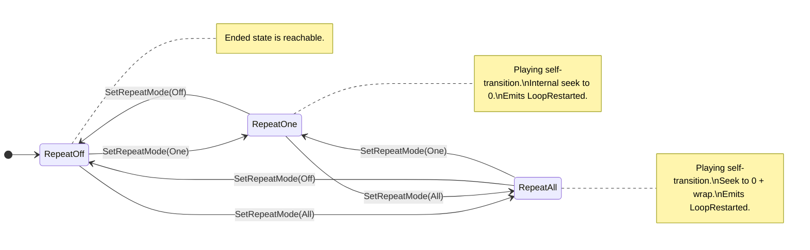
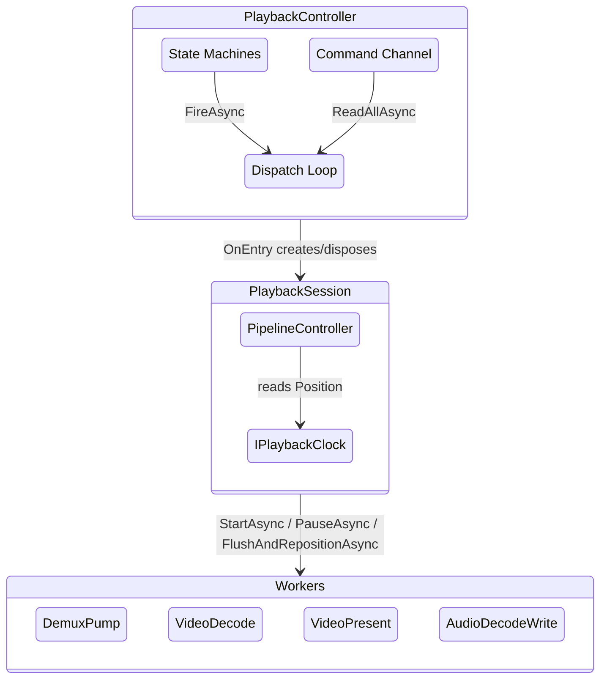
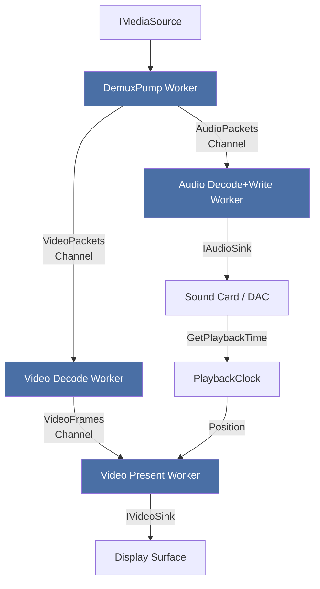
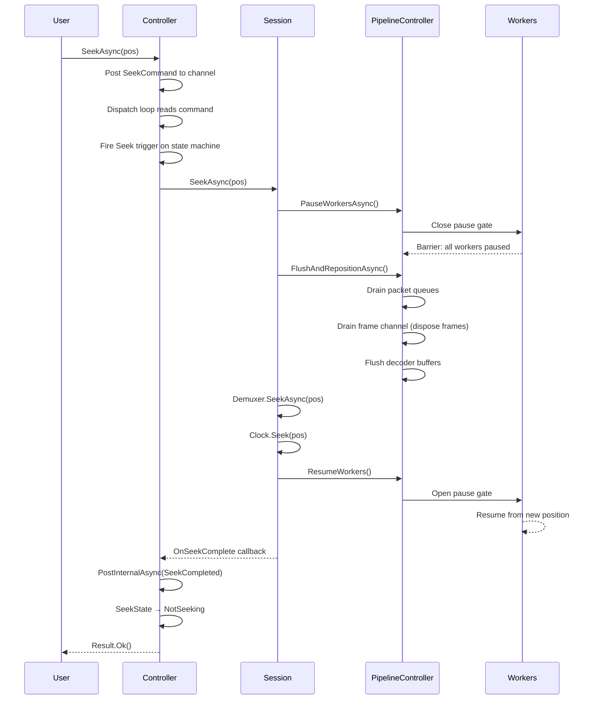
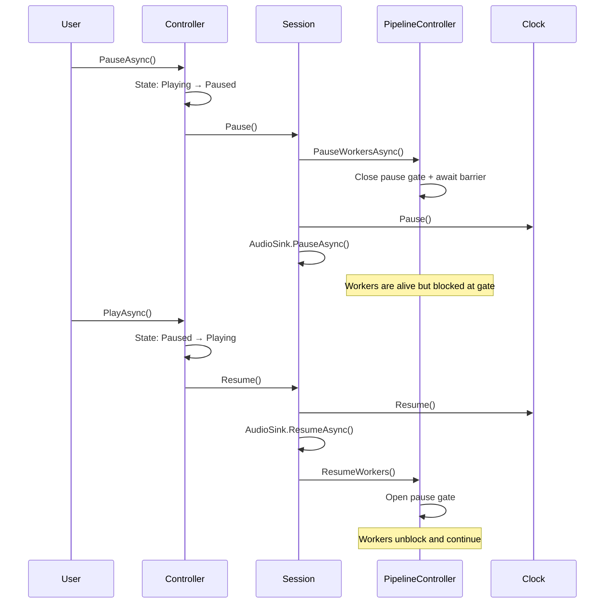

# FrameFlow — Statechart Diagrams

Mermaid statechart diagrams for the refactored playback architecture.
Each section is a separate diagram covering one region.

**Governing ADR:** [ADR-0023](../adr/ADR-0023-hierarchical-state-machine-with-channel-dispatch.md)

**Companion documents:**
- [playback-states](playback-states.md) — full state & transition catalogue
- [playback-controller](playback-controller.md) — controller architecture

---

## 1. Primary Playback State Machine

---

## 2. Seeking (Orthogonal Region)

---

## 3. Repeat / Loop Mode (Orthogonal Region)

---

## 4. Three-Layer Architecture Overview

---

## 5. Worker Pipeline Flow

---

## 6. Seek Sequence

---

## 7. Pause / Resume Sequence

